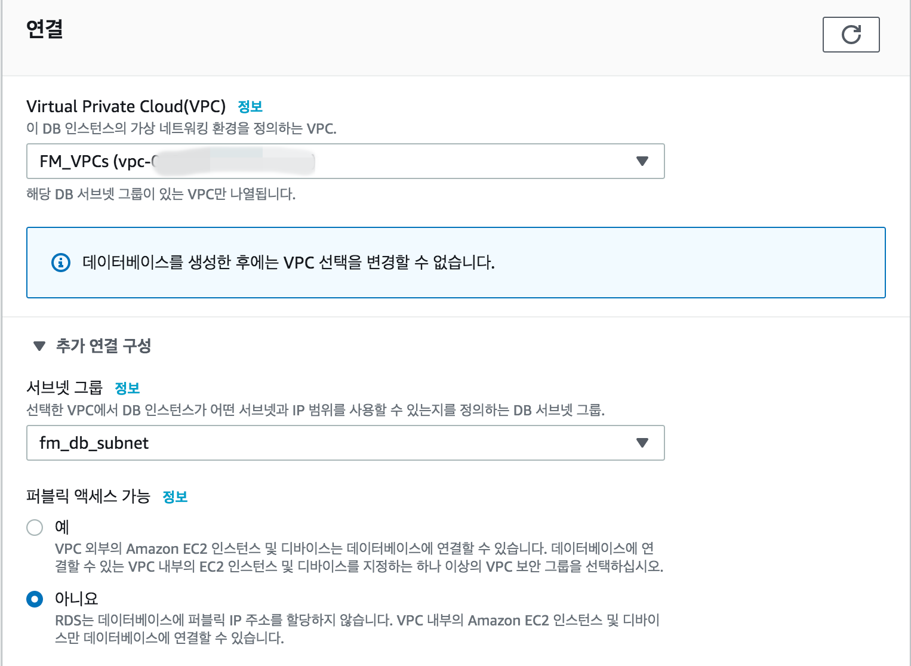
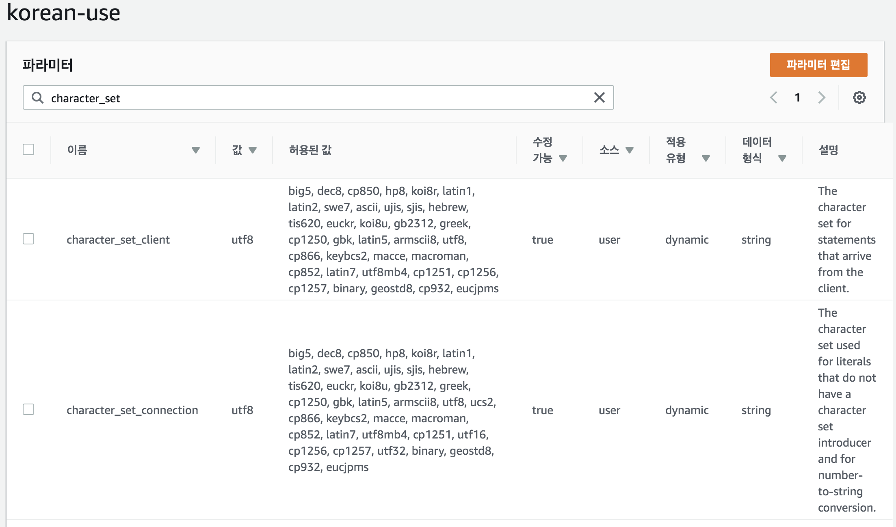

## AWS RDS DB 구성

foremessage DB는 aws RDS를 이용해서 구성할 생각이다. 다른 이유는 없고, 돈 없는 대학생 개발자다보니 프리티어로 모든걸 띄울려고 했고, aws RDS는 1년간 t2.micro로 무료제공이 되다보니 따로 instance를 띄울 필요없이 RDS를 쓰기로 했다.

### AWS RDS

\- 아마존 관계형 데이터베이스 서비스(Amazon Relational Database Service) 또는 아마존 RDS(Amazon RDS)는 아마존 웹 서비스(AWS)가 서비스하는 분산 관계형 데이터베이스이다. 

\- 애플리케이션 내에서 관계형 데이터베이스의 설정, 운영, 스케일링을 단순케 하도록 설계된 클라우드 내에서 동작하는 웹 서비스이다.

\- 데이터베이스 소프트웨어를 패치하거나 데이터베이스를 백업하거나 시점 복구를 활성화하는 것과 같은 복잡한 관리 프로세스들은 자동으로 관리된다.

\- 스토리지와 연산 자원들을 스케일링하는 것은 하나의 API 호출로 수행할 수 있다.

### RDS 설정

rds db생성.

DB는 익숙한 Mysql을 사용하도록 한다. 버젼은 5.7 버젼을 사용.

DB 인스턴스는 구분이가능하도록 foremessage_DB로 설정하고 나머지 정보들을 입력.

인스턴스는 프리티어로 사용하기 위해 t2.micro로 설정한다.

스토리지는 기본으로 설정.

VPC는 기존에 구성해놓은 VPC를 이용. 서브넷은 두 AZ를 사용할 수 있도록 한 DB subnet을 이용한다. private subnet에 존재하여 내부 ip로만 통신하므로 퍼블릭 액세스는 필요가 없다.

subnet 정보.

보안 그룹은 3306포트만 10.30.0.0/16으로 열어둔다. 내부 vpc안에서만 가능하도록 한다. 가용 영역은 아무거나 상관없으며 포트는 3306 사용.

### RDS 한글 문제

생성할때 파라미터 그룹을 기본으로 설정한 경우, DB에 한글이 전부 ?로 표시되며 정상적으로 표기가 되지 않는다. 이는  Default인코딩이 UTF-8이 아닌 latin-1이여서 생기는 문제인데 이문제를 해결하기 위해 파라미터 그룹을 수정해야한다.

파라미터 그룹을 새로 생성한 후, character_set으로 검색해서 나오는 값들을 utf-8로 변경.

### [참고]

https://devjjo.tistory.com/31

https://winterandsnow.tistory.com/12