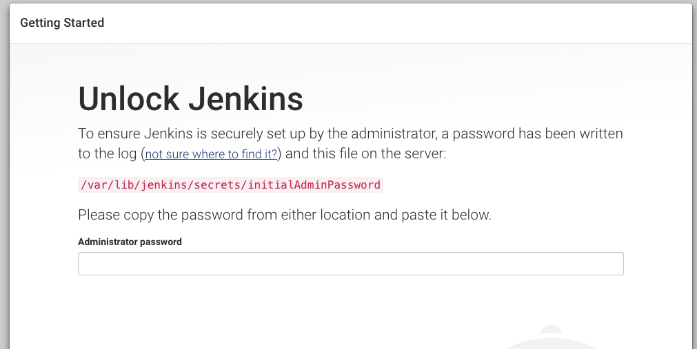
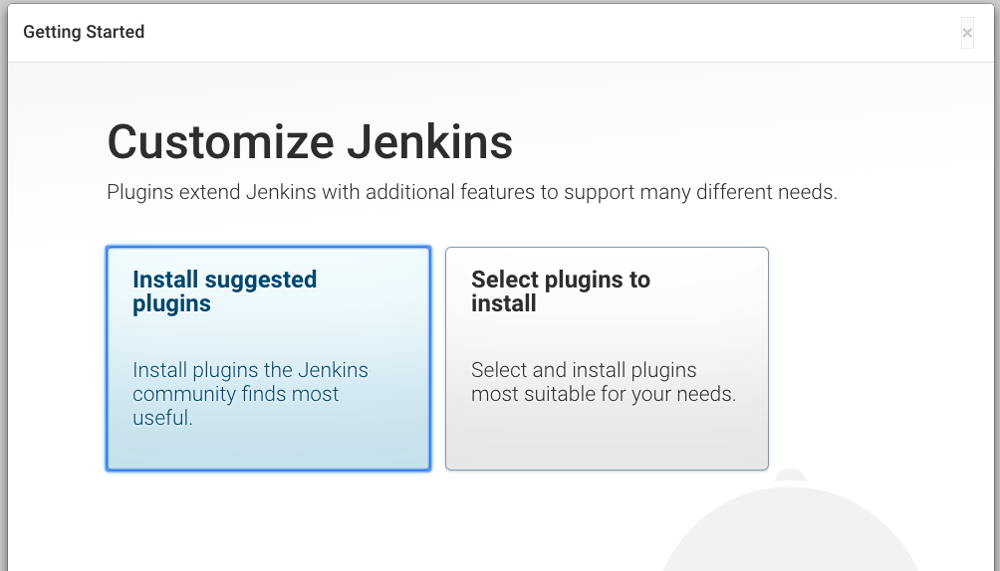
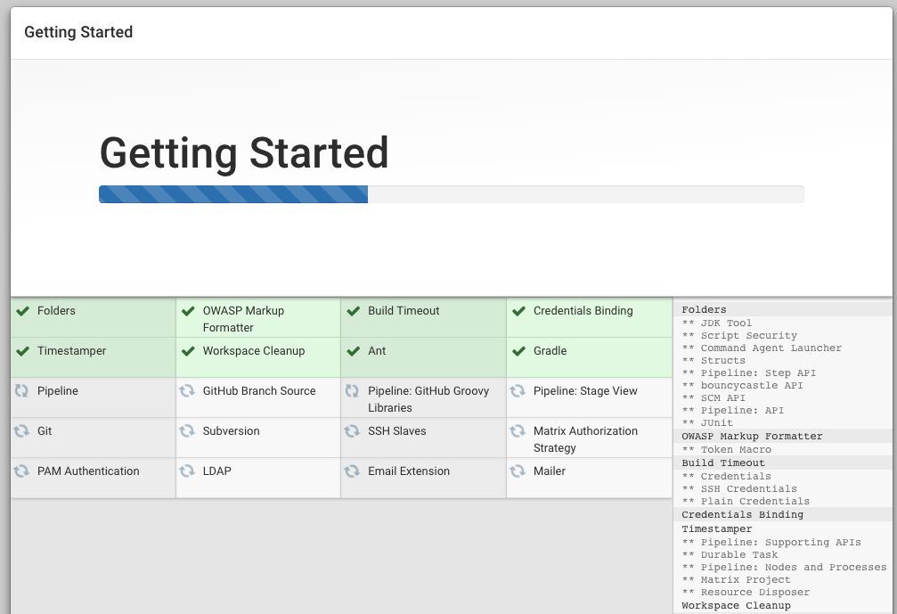
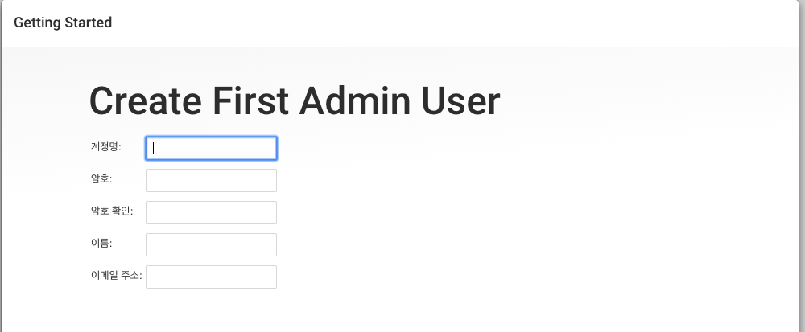
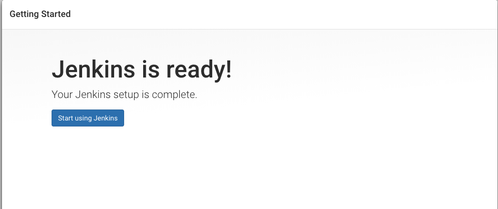

##### foremessage Jenkins server Setting

----------

Rails api 서버 구성까지 완료되었으므로, 다음은 CI/CD를 위한 jenkins를 설정할 단계이다. 


##### java 설치

jenkins는 java기반이므로, java부터 설치해야한다. java는 8버전으로 설치한다.

```shell
# git, openjdk-8 install
sudo apt-get update
sudo apt-get install git openjdk-8-jdk -y
```


##### Jenkins 설치

```shell
# add the repository key to the system.
wget -q -O - https://pkg.jenkins.io/debian/jenkins-ci.org.key | sudo apt-key add -
```

key가 추가 된 후, Ok가 나오게 되면 Debian package를 sources.list에 추가한다.

```shell
# append the Debian package repository address to the server's sources.list
echo deb https://pkg.jenkins.io/debian-stable binary/ | sudo tee /etc/apt/sources.list.d/jenkins.list
```

Apt-get update 이후 jenkins를 설치한다.

```shell
# apt-get update
sudo apt-get update

# install jenkins
sudo apt-get install jenkins
```


##### jenkins 구동

Jenkins를 `systemctl` 을 이용해서 시작한다.

```shell
sudo systemctl start jenkins
```

systemctl은 output을 출력하지 않으므로, `status` 명령어를 이용해서 확인한다.

```shell
sudo systemctl status jenkins
```

jenkins는 8080 포트를 사용하므로 security group에서 8080포트를 열어둬야한다.


http://Ip_address:8080으로 접속해보면, 



초기 비밀번호를 `/var/lib/jenkins/secrets/initialAdminPasswod` 에 있는 값을 치고 들어간다.




suggested plugin을 설치.







초기 어드민 유저를 설정한다.





##### reverse proxy 구성

jenkins는 기본 8080포트를 사용하므로 DNS를 지정할 경우, domain:8080으로 접속하여야 한다. 따라서 80포트로 접속하면 8080포트로 갈 수 있도록 구성한다.

Reverse proxy는 ngnix를 이용해서 구성한다.


##### nginx 설치

```shell
sudo apt-get install nginx
```


80포트를 사용하므로 security group에 80포트도 추가하도록 한다.

ngnix 상태를 확인해본다.

``` shell
systemctl status nginx
```

```shell
● nginx.service - A high performance web server and a reverse proxy server
   Loaded: loaded (/lib/systemd/system/nginx.service; enabled; vendor preset: enabled)
   Active: active (running) since Sun 2019-08-11 17:21:34 KST; 4min 3s ago
 Main PID: 12189 (nginx)
   CGroup: /system.slice/nginx.service
           ├─12189 nginx: master process /usr/sbin/nginx -g daemon on; master_process on
           └─12190 nginx: worker process

Aug 11 17:21:34 ip-10-30-2-241 systemd[1]: Starting A high performance web server and a reverse proxy server...
Aug 11 17:21:34 ip-10-30-2-241 systemd[1]: nginx.service: Failed to read PID from file /run/nginx.pid: Invalid argument
Aug 11 17:21:34 ip-10-30-2-241 systemd[1]: Started A high performance web server and a reverse proxy server.
```

active(running )상태면 정상적으로 동작하는 것이다.


##### nginx 명령어

nginx 중지

```shell
sudo systemctl stop nginx
```

nginx 시작

```shell
sudo systemctl start nginx
```

nginx 재시작

```shell
sudo systemctl restart nginx
```

cnofiguration이 변경되어서 nginx를 connection drop 없이 재기동시키기를 원하면 reload를 사용.

```
sudo systemctl reload nginx
```

기본적으로 nginx는 서버가 부팅되면 자동으로 실행 되는데 이를 원치 않으면 다음과 같이 설정한다.

```
sudo systemctl disable nginx
```

다시 자동으로 실행되기를 원하면 다음과 같이 설정.

```
sudo systemctl enable nginx
```


##### ngnix config 수정

```shell
sudo vi /etc/nginx/sites-available/default
```

```shell
. . . 
server {
        # SSL Configuration
        #
        # listen 443 ssl default_server;
        # listen [::]:443 ssl default_server;
        access_log            /var/log/nginx/jenkins.access.log;
        error_log            /var/log/nginx/jenkins.error.log;
```

access_log, error_log를 추가.

```shell
. . .
           location / {
                # First attempt to serve request as file, then
                # as directory, then fall back to displaying a 404.
                # try_files $uri $uri/ =404;        }
. . . 
```

try_files $url #url/ =404; 라인 주석처리.

```shell
Location /  
. . .
           location / {
                # First attempt to serve request as file, then
                # as directory, then fall back to displaying a 404.
                # try_files $uri $uri/ =404;
                include /etc/nginx/proxy_params;
                proxy_pass          http://localhost:8080;
                proxy_read_timeout  90s;
                # Fix potential "It appears that your reverse proxy set up is broken" error.
                proxy_redirect      http://localhost:8080 http://jenkins.foremessage.com;
```

미리 foremessage.com domain을 구입하였고, 해당 서브도메인에 jenkins ip를 등록해두었다.

test를 진행해보면

```shell
sudo nginx -t
```

```shell
nginx: the configuration file /etc/nginx/nginx.conf syntax is ok
nginx: configuration file /etc/nginx/nginx.conf test is successful
```

이렇게 나오면 테스트가 통과된거다.


##### jenkins config 수정

```shell
sudo nano /etc/default/jenkins
```

```shell
. . .
JENKINS_ARGS="--webroot=/var/cache/$NAME/war --httpPort=$HTTP_PORT --httpListenAddress=127.0.0.1"
```

`JENKINS_ARGS` 에 `--httpListenAddress=127.0.0.1` 를 추가.


Jenkins와 nginx 재기동 시킨다.

```shell
sudo systemctl restart jenkins
```

```shell
sudo systemctl status jenkins
```

```
Output
● jenkins.service - LSB: Start Jenkins at boot time
   Loaded: loaded (/etc/init.d/jenkins; bad; vendor preset: enabled)
   Active: active (exited) since Tue 2017-04-25 22:37:29 UTC; 5s ago
     Docs: man:systemd-sysv-generator(8)
  Process: 11360 ExecStop=/etc/init.d/jenkins stop (code=exited, status=0/SUCCESS)
  Process: 11391 ExecStart=/etc/init.d/jenkins start (code=exited, status=0/SUCCESS)

```

```shell
sudo systemctl restart nginx
```

```shell
sudo systemctl status nginx
```

```
Output
● nginx.service - A high performance web server and a reverse proxy server
   Loaded: loaded (/lib/systemd/system/nginx.service; enabled; vendor preset: enabled)
   Active: active (running) since Tue 2017-04-25 22:36:08 UTC; 2min 51s ago
  Process: 11339 ExecStop=/sbin/start-stop-daemon --quiet --stop --retry QUIT/5 --pidfile /run/nginx.pid (code=
  Process: 11349 ExecStart=/usr/sbin/nginx -g daemon on; master_process on; (code=exited, status=0/SUCCESS)
  Process: 11345 ExecStartPre=/usr/sbin/nginx -t -q -g daemon on; master_process on; (code=exited, status=0/SUC
 Main PID: 11353 (nginx)
```


[출처]

https://www.digitalocean.com/community/tutorials/how-to-install-jenkins-on-ubuntu-16-04

https://www.digitalocean.com/community/tutorials/how-to-configure-jenkins-with-ssl-using-an-nginx-reverse-proxy

