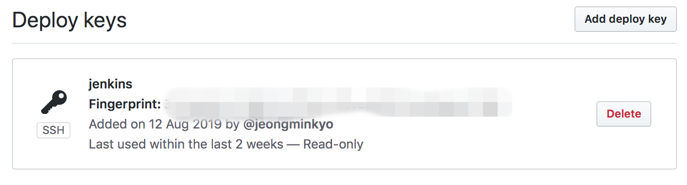
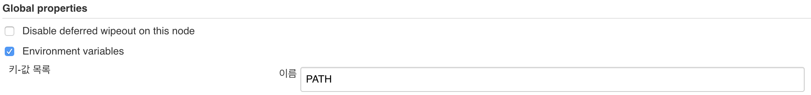
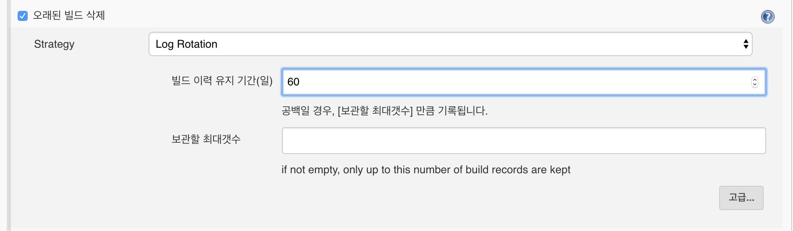
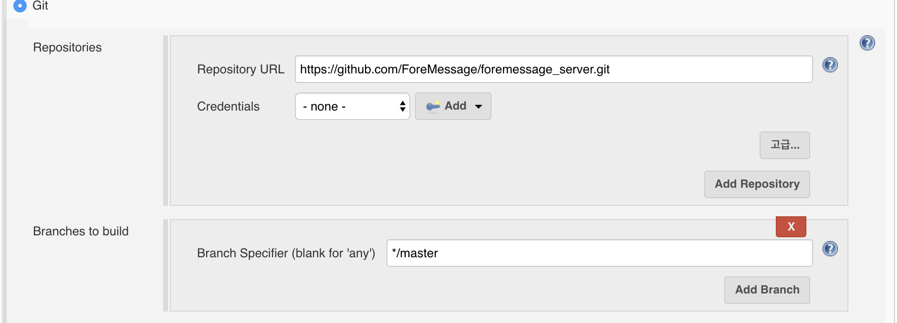
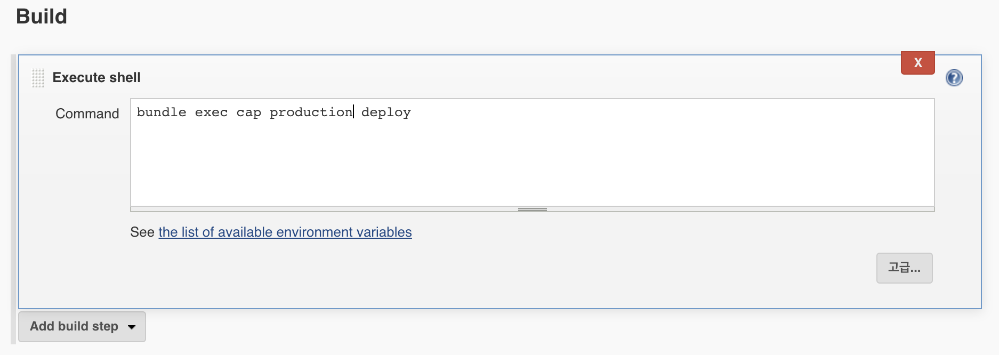

##### 

#### Jenkins CI CD 구축하기

---------

Jenkins를 이용해서 CD를 구축할려고 하는데, CD툴은 capistrano를 이용한다. capistrano를 이용하는 이유는 딱히 없다. 회사에서 capistrano를 이용해서 배포를 하고 있어서 가장 참고해볼 수 있는 소스도 많았고, 물어볼 수 있는 사람들이 많아서 이용했다. 추후에 docker로 passenger를 띄울 수 있도록 변경하면, 그때는 capistrano가 아닌 ansible을 이용해서 해볼 생각이다.


##### Capistrano

공식문서에는 아래와 같이 나와있다.

```
Capistrano is a remote server automation tool.
It supports the scripting and execution of arbitrary tasks, and includes a set of sane-default deployment workflows.

Capistrano can be used to:

Reliably deploy web application to any number of machines simultaneously, in sequence or as a rolling set
To automate audits of any number of machines (checking login logs, enumerating uptimes, and/or applying security patches)
To script arbitrary workflows over SSH
To automate common tasks in software teams.
To drive infrastructure provisioning tools such as chef-solo, Ansible or similar.
Capistrano is also very scriptable, and can be integrated with any other Ruby software to form part of a larger tool.
```

이를 번역해보자면, cpaistrano는 원격 서버 자동화 도구이며, 스트립팅 및 실행을 지원하며 배포 워크 플로를 포함한다.

또한 순차적인 rolling set으로 동시에 여러 서버를 안정적으로 배포 할 수 있다라고 되어있다. 또한 capistrano를 이용하면 rollback도 쉽다.


##### capistrano structure

```tree
├── current -> /var/www/my_app_name/releases/20150120114500/
├── releases
│   ├── 20150080072500
│   ├── 20150090083000
│   ├── 20150100093500
│   ├── 20150110104000
│   └── 20150120114500
├── repo
│   └── <VCS related data>
├── revisions.log
└── shared
    └── <linked_files and linked_dirs>
```

capistrano를 이용해서 배포를 하면 기본 구조는 위와 같이 설정된다.


##### Capistrano 동작 순서

Capistrano 동작순서는 다음과 같다.

1. jenkins 서버에서 해당 소스코드를 pull 받는다.
2. bundle install을 한다.
3. capistrano에 설정되어있는 해당 서버에 배포를 한다.

배포를 어떻게 하는가? 하면 jenkins서버에서 해당서버로 ssh 접속을 통해서 capistrano에 정의된 명령어들을 수행한다.

따라서 capistrano를 통해서 배포를 할려면 jenkins서버에서 해당 git을 pull할 수 있는 권한이 있어야 하며, jenkins 서버에서 배포 서버에 ssh를 접속을 할 수 있어야한다. 또한 jenkins 서버에서 bundle install을 해야하므로, jenkins서버에 ruby가 깔려 있어야 한다.

먼저 이 설정부터 시작한다.


##### 배포 사전 작업

1. ssh key 생성

   ssh key를 먼저 생성한다. key 생성은 다음을 참조한다(https://help.github.com/en/enterprise/2.16/user/articles/generating-a-new-ssh-key-and-adding-it-to-the-ssh-agent)

   ```bash
   ssh-keygen -t rsa -b 4096 -C "your_email@example.com"	
   ```

2. jenkins 서버 ruby 설치

   기존 로직 서버에서 했던것과 똑같이 rbenv를 설치하고, ruby를 설치를 하면 된다. 해당 설명은 생략한다.

3. Jenkins 서버 git pull 권한 얻기

   git을 pull 받기에는 2가지 방법이 있다. https와 ssh.

   https는 아무 설정 없이도 그냥 pull을 받으면 되지만, ssh의 경우에는 jenkins 서버의 ssh 키가 github 권한을 가져야한다.

   공개키를 해당 repo의 settings 메뉴에 deploy keys에 등록한다.

   ```bash
   cat ~/.ssh/id_rsa.pub
   ```

   하지만 여기서는 그냥 https를 사용할려고 하므로 크게 상관은 없다.

   

4. 배포 서버에 jenkins ssh 옮기기

   .ssh 폴더 하위에 있는 id_rsa.pub 파일을 배포 서버에 authorized_keys에 추가한다.

   ```bash
   ssh <username>@<app-server-id> "ruby –v"
   ```

   ruby version이 정상적으로 출력되면 설정이 잘 완료된 것이다.


##### capistrano gem 파일 설정

Gemfile에 해당 gem을 추가한다.

```ruby
gem 'capistrano', '~> 3.7'
gem 'capistrano-rails', '~> 1.1.0'
gem 'capistrano-rbenv'
gem 'capistrano-bundler'
gem 'capistrano-passenger', '~> 0.2.0'
gem 'capistrano-nginx'
```

 bundle install 후, 

```bash
cap install
```

Capfile파일, cofing/deploy.rb파일과 config/deploy/<stage_name>.rb 파일이 생성이 된다.


config/deploy/production.rb

```ruby
set :stage, :production
set :branch, 'master'
server '10.30.1.232', user: 'ubuntu', roles: %w{web app db}
```

stage는 production이며, 배포 브랜치는 master, server는 배포 할려는 서버의 ip를 쓴다. user는 배포할려는 유저를 적으면 된다.


config/deploy.rb

```ruby
lock "~> 3.11.0"

set :application, 'foremessage_server'
set :repo_url, 'git@github.com:ForeMessage/foremessage_server.git'

set :deploy_to, '/var/www/foremessage_server'
set :bundle_flags, ""
set :use_sudo, true
set :rbenv_ruby, '2.5.0'

set :passenger_restart_with_sudo, true
set :passenger_restart_with_touch, true
set :passenger_in_gemfile, true
set :passenger_restart_options,
    -> { "#{deploy_to} --ignore-app-not-running --rolling-restart" }

set :linked_dirs, %w{log}
append :linked_files, "config/master.key"

namespace :deploy do
  desc 'Restart application'
  after 'deploy:published', 'nginx:restart'

  task :restart do
    on roles(:web), in: :sequence, wait: 20 do
    end
  end
  after :finishing, 'deploy:cleanup'
end
```

해당 파일의 자세한 내용은 공식사이트를 참고하면 자세한 내용이 나온다.

몇개만 설명하면, 

repo_url은 배포 서버에서 pull 땡길려는 git 주소이다. 

deploy_to는 배포 위치이며,

rbenv_ruby는 ruby version을 지정한것이다.

linked_dirs는 capistrano structure에서 shard에 들어갈 공용으로 쓰는 폴더를 명시하는 곳이다.

namespace와 task는 ruby에서의 rake 잡과 같이 특정 명령어 후, 또는 전에 수행 할 수 있도록 명령어를 지정하도록 설정한 곳이다.


Capfile

```ruby
require "capistrano/rbenv"
require "capistrano/bundler"
require "capistrano/rails/assets"
require "capistrano/rails/migrations"
require "capistrano/passenger"
require "capistrano/nginx"
```

capfile은 필요한부분만 주석을 해제해서 사용하면 된다.


##### 추가 nginx config 수정

/etc/nginx/nginx.conf

```bash
user ubuntu;
```

user를 배포할려는 사용자로 변경해준다. 추후 배포과정에서 권한관련 문제가 생길경우, 여기 설정해놓은 유저의 권한이 없어서 생기는 문제이다.

/etc/nginx/sites-available/default

```bash
server {
        listen 80 default_server;
        listen [::]:80 default_server;

        root /var/www/cashstagram/current/public;

        # Add index.php to the list if you are using PHP
        index index.html index.htm index.nginx-debian.html;

        server_name _;

        passenger_enabled on;
        passenger_ruby                  /home/devops/.rbenv/shims/ruby;
        passenger_app_env               pruoduction;
}
```

root를 배포 앱의 public으로 잡는다.

passenger_enabled를 on으로 하고, passenger_ruby의 위치를 설정한다음 환경을 production으로 설정한다.


##### Rails secret 설정

EDITOR=vim rails credentials:edit를 이용해서 credential.yml.enc를 수정한다.

```
rails secret
```

나오는 결과값을 credential.yml에 secret_key_base를 추가한다.


##### jenkins 유저 환경변수

jenkins는 jenkins user를 이용해서 해당 job들을 수행한다. 하지만 우리는 ubuntu 유저에서 rbenv를 이용해서 ruby를 설치하였으므로, jenkins 유저는 ruby를 사용하지 못한다. 해당 문제를 해결하기 위해서 jenkins 유저에 rbenv와 ruby를 설치할 수 있으나, ubuntu유저의 환경변수를 jenkins 환경변수에 추가를 하도록 한다.

```bash
echo $PATH
```

결과값을 

jenkins 관리에 시스템 설정에서 global properties에 키 값을 추가한다.




##### deploy

jenkins 서버에서 deploy test를 해본다.

```bash
cap production deploy:check
```

X 표시가 나온것은 정상적으로 설치가 되지 않았다는 것이다. 해당 부분은 다시 설정하도록 한다.

정상적으로 check표시가 나오는 경우, 실제 배포를 해본다.

```
cap production deploy
```


##### Jenkins job



해당 부분을 설정해 놓으면, 60일이 넘어간 빌드에 대해서는 jenkins가 삭제를 해준다.




jenkins에서 git pull을 땡겨갈 url이다. https가 아닌 ssh로 할 경우, credentials을 추가해주면 된다.




실제로 수행될 명령어를 적어놓으면 된다.


모든 설정이 완료가 되면 jenkins job을 build하게 되면 배포가 진행되는 걸 확인할 수 있다.


jenkins에서 git pull을 땡기는 이유는 배포와 관련된 capfile, deploy파일이 소스코드에 같이 존재하기 때문이다. 해당 파일의 수정이 없는 경우에는 굳이 jenkins에서 git pull을 땡길 이유는 없다. 

추후에는 해당 deploy 파일들을 따로 관리할 수 있도록 수정이 필요하다.


[출처]

https://capistranorb.com/

https://help.github.com/en/enterprise/2.16/user/articles/generating-a-new-ssh-key-and-adding-it-to-the-ssh-agent