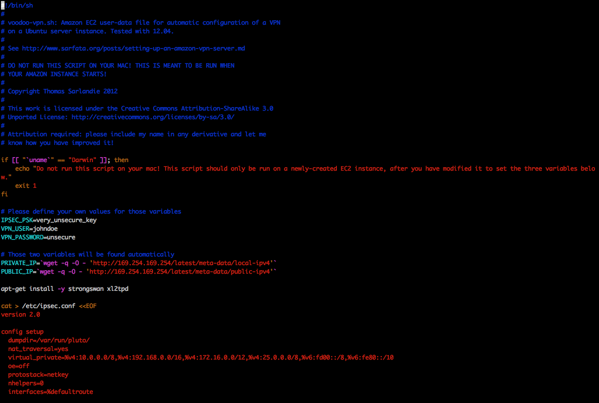
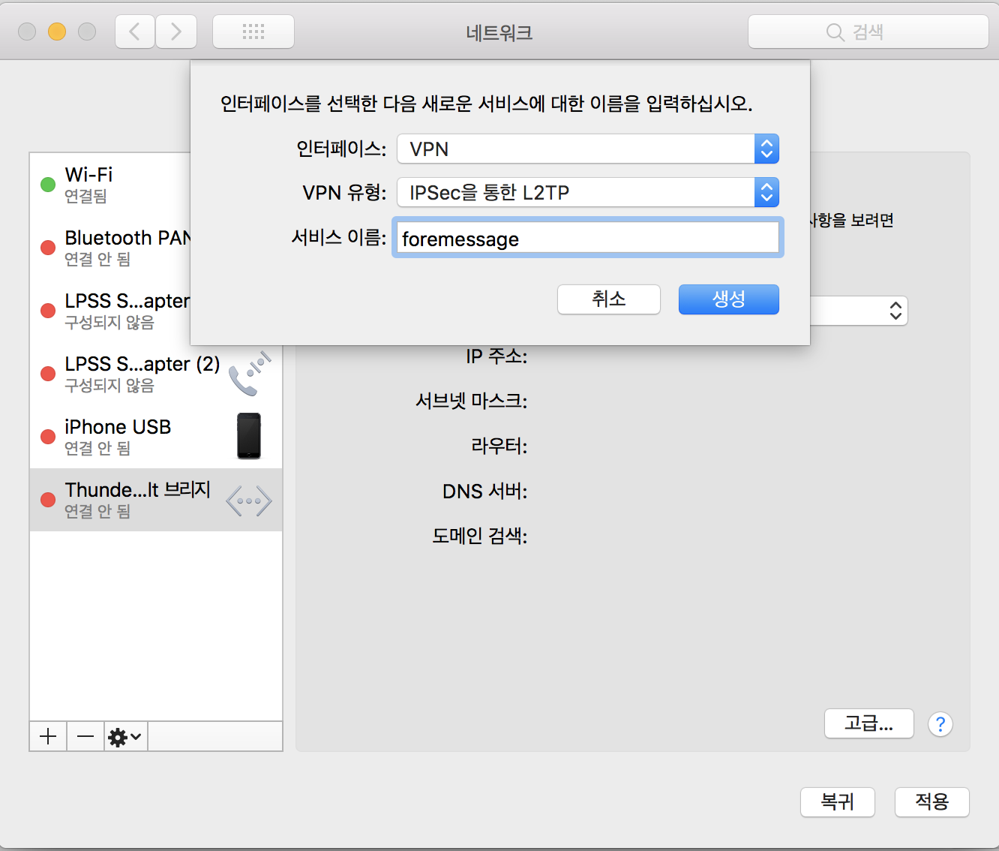
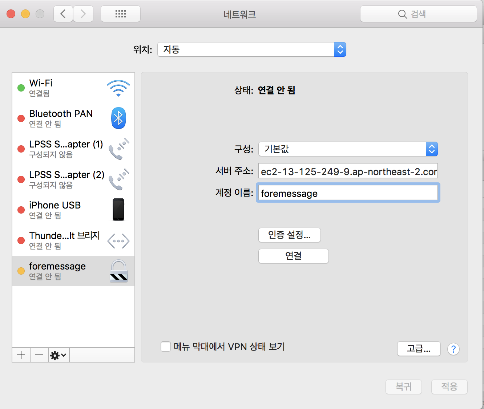
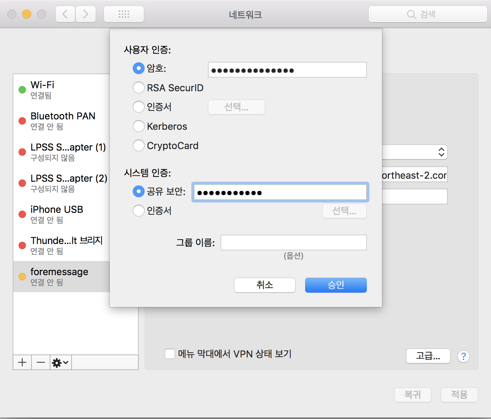

## AWS EC2 instance를 이용해 VPN 구축하기

foremessage 관련해서 서버들을 구축하다보니 외부에서 작업을 할 때가 많았는데, 외부에 나갈때마다 security group의 22번 포트에 접근가능한 ip를 변경할려고 하니 너무 번거로운 작업이였다. 또한 내가 아닌 서버 개발자인 친구가 서버에 접근할려고 하면 해당 위치의 ip를 받아서 ssh에 넣어주는 번거로운 작업을 계속해야되서 vpn을 구축할려고 한다. 구글링을 한 결과 ec2 인스턴스로 vpn을 구성할 수 있다고 해서 ec2로 vpn을 구축을 한다.


### 기본 구성

돈이 없는 대학생 개발자여서 모든 서비스들을 프리티어로 띄울려고 한다. 이미 사용하고 있는 aws계정에서는 이미 인스턴스를 api 서버 1대, jenkins 1대를 띄우고 있어서 계정을 새로 만들어서 인스턴스를 생성을 한다.


### VPN 설치

[Voodoo Privacy Project](https://github.com/sarfata/voodooprivacy)에서 제공하는 VPN script를 이용해서 설치한다.

```shell
wget https://raw.githubusercontent.com/sarfata/voodooprivacy/master/voodoo-vpn.sh	
```

설치하고 나면 **voodoo-vpn.sh**가 생긴다.

```shell
sudo vi voodoo-vpn.sh	
```

Voodoo-vpn.sh를 열어보면,



IPSEC_PSK, VPN_USER, VPN_PASSWORD를 변경해주고 저장한다.

그다음 관리자 권한으로 설치.

```shell
sudo bash voodoo-vpn.sh
```

이러면 모든 설정이 끝난다.


### MAC에서 VPN 설정하기



시스템설정 > 네트워크 환경 설정 열기로 들어가서 +를 누른 후 위와 같이 설정한다.




서버 주소는 ec2의 주소, 계정 이름은 위에서 설정한 VPN_USER 값을 넣는다.




암호에는 VPN_PASSWORD 값을, 시스템 인증에 공유 보안에는 IPSEC_PSK을 집어 넣으면 된다.

고급을 누르면 VPN 연결을 통해 모든 트래픽 전송을 체크하면 모든 설정이 완료된다.


### 참고

https://www.haruair.com/blog/2518