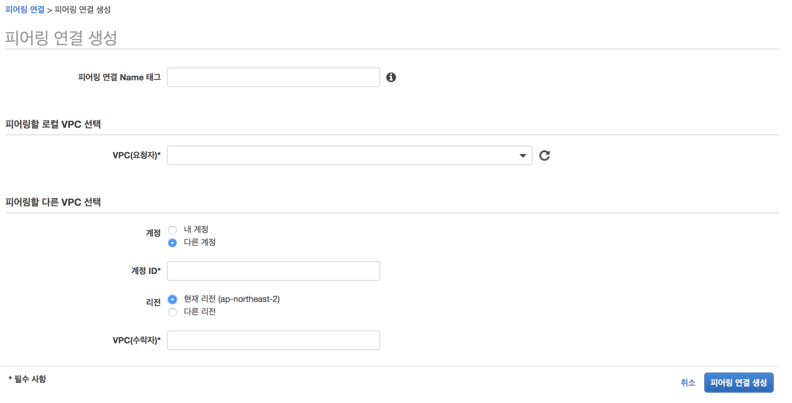
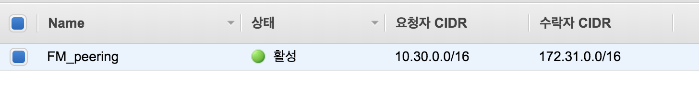
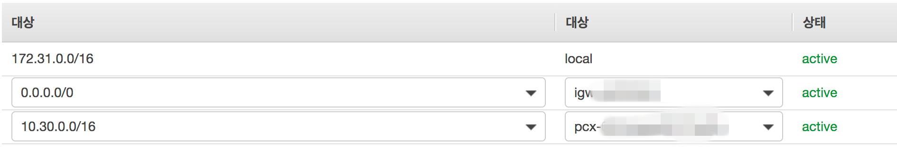
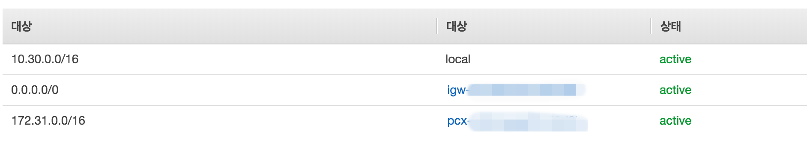

## VPC peering 구성

EC2를 이용해서 VPN 구성을 하였는데 이렇게 한 경우, 계정 간의 VPC가 서로 다르기 때문에 vpn을 구성을 하더라도 private subnet에 접근을 할 수가 없게 된다. 따라서 vpn계정의 VPC와 foremessage의 VPC와 peering 연결을 통해 이 문제를 해결할려고 한다. 아래는 VPC Peering 을 위한 기본 전제 조건이다. 

- 두 VPC 의 CIDR 블럭이 중복되는 경우 연결이 불가하다. 
- VPC 당 Peering 은 최대 50개 가능하다. 
- VPC Peering 간 MTU는 1,500 byte 이다.

 위 제약 조건을 제외 하고는 VPC 간 Peering 연결이 가능하며, 다른 계정에 있는 VPC도 연결이 가능하다. 

VPN의 경우 따로 vpc를 설정을 하지 않았으므로 기본인 172.31.0.0/16으로 잡혀 있어서 CIDR블럭이 중복되지도 않는다.

### VPC peering 설정

Foremessage 계정에서 VPC 메뉴에 피어링 연결 메뉴 선택한다.

로컬 VPC에는 foremessage vpc를 선택하고 vpn 계정 ID와 vpc ID를 넣는다.

vpn 계정으로 접속 한 후, 피어링 연결 탭에서 확인해보면 상대 VPC에서의 요청을 볼 수 있다. 처음에는 pending-acceptance 이고, 요청을 수락하면 active상태로 변경된다.

### routing table 설정

서로간 통신이 가능하도록 Route table을 설정해 줘야 한다. vpn계정에서 foremessage VPC로 통신할 수 있도록 vpn계정에 route table에 foremessage VPC를 추가해준다.

반대로 foremessage VPC route table에 vpn 계정을 추가해준다.

### [참고]

https://bluese05.tistory.com/49