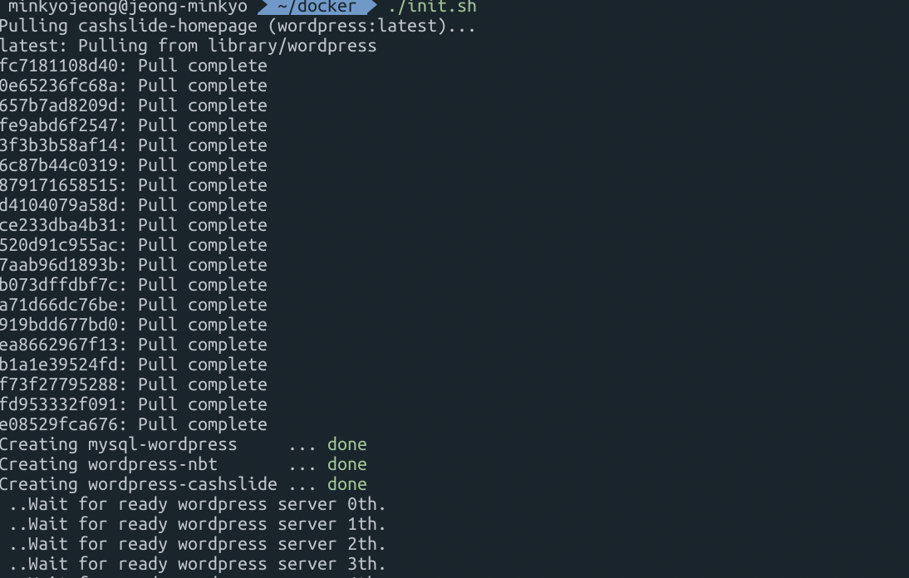
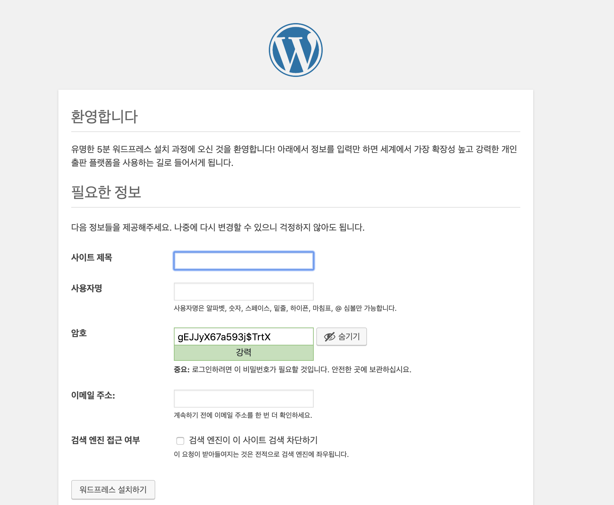
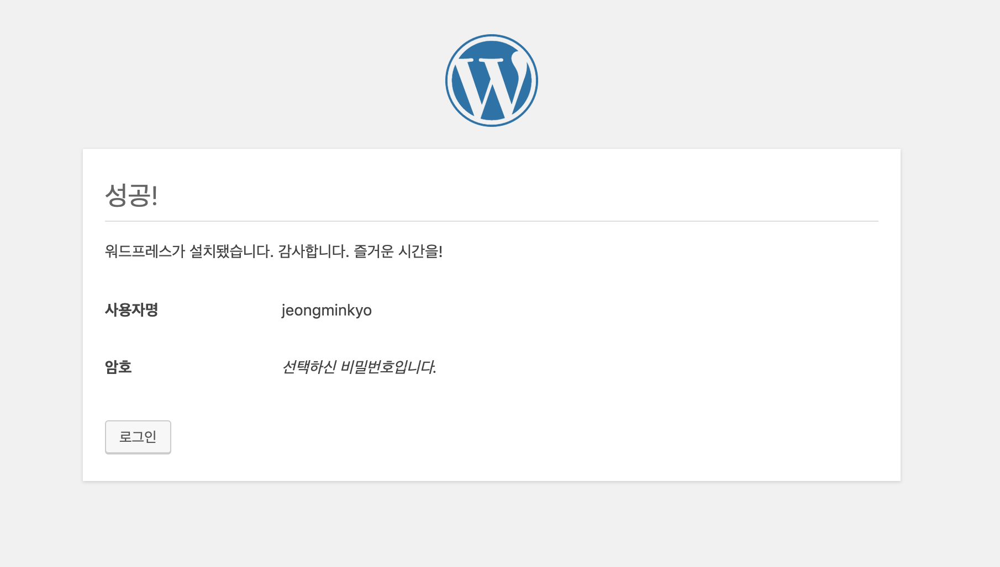
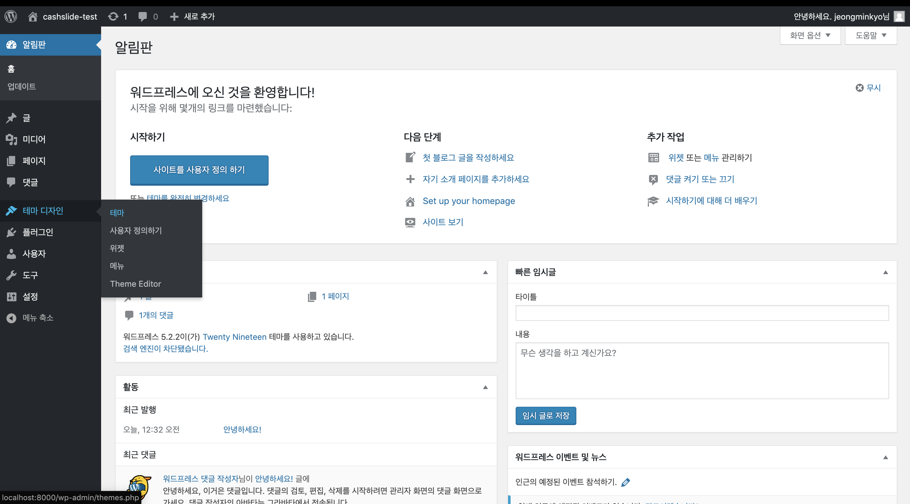
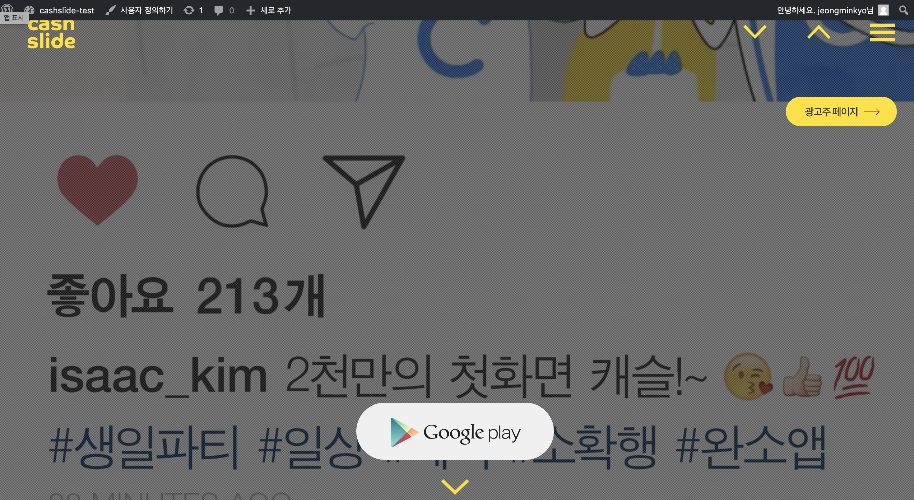

## Docker로 Wordpress 사용하기

사내 홈페이지 및 제품 홈페이지는 wordpress로 되어있다.

종종 이 홈페이지에 대해서 몇몇 수정요청이 들어오고 있는데, 주로 들어오는 것이 아니다보니 개발환경 셋팅이 되어있지 않다.

지난번에는 요청이 들어와서 vagrant를 이용해서 개발환경을 setting했었으나, 개발 컴퓨터를 바꾸는 과정에서 다시 vagrant를 이용해서 지난번처럼 setting을 할려고 하니, vagrant image 문제도 있고, 정상적으로 설치가 되지 않아서 이번 기회에 docker를 이용해서 환경을 구성할려고 한다.

최근에 진행하고 있는 프로젝트가 docker를 이용하기도 하고, 마침 괜찮은 기회인 것 같아서 docker를 공부하고 docker를 이용해서 wordpress 개발 환경을 setting을 해본다.


### 기본 구성

사내 홈페이지 및 제품 홈페이지는 wordpress theme이고, 해당 코드는 회사 github를 이용해서 코드를 관리하고 있다. 컨테이너를 생성하고, theme위치에 대해 해당 소스를 설치해야한다.


### Docker 설치

개발 노트북은 Mac이여서 Mac 환경에 맞춰 docker를 설치한다.

brew를 이용해서 설치해도 되고, [Docker for mac](https://docs.docker.com/docker-for-mac) 를 이용해서 설치를 해도 된다.

설치 관련은 https://subicura.com/2017/01/19/docker-guide-for-beginners-2.html를 참고.


### Docker-compose 설치

이번에 띄울 컨테이너는 사내 홈페이지 wordpress 1대, 제품 홈페이지 wordpress 1대, 해당 wordpress DB를 사용할 mysql 1대 총 3대를 띄울려고 한다.

컨테이너를 띄울 때, 1대 1대 일일히 띄우기 번거롭기 때문에 docker-compose를 이용해서 한꺼번에 띄울려고한다.

docker-compose는 [Docker for mac](https://docs.docker.com/docker-for-mac) 로 설치한 경우, 자동으로 설치된다.


### Docker-compose.yml 파일 작성하기

```yml
version: '2.1'

volumes:
  mysql_local_dev: {}

services:
  mysql:
    image: mysql:5.6
    container_name: "mysql"
    volumes:
      - mysql_local_dev:/var/lib/mysql
    ports:
      - "23306:3306"
    environment:
      - MYSQL_ROOT_PASSWORD=mysql
      
  cashslide-homepage:
    image: wordpress:latest
    restart: always
    container_name: "wordpress-cashslide"
    ports:
      - "8000:80"
    volumes:
      - ./cashslide-homepage:/var/www/html/
    environment:
      WORDPRESS_DB_HOST: mysql:3306
      WORDPRESS_DB_USER: root
      WORDPRESS_DB_PASSWORD: mysql
      WORDPRESS_DB_NAME: wordpress_cashslide

  nbt-homepage:
    image: wordpress:latest
    restart: always
    container_name: "wordpress-nbt"
    ports:
      - "9000:80"
    volumes:
      - ./nbt-homepage:/var/www/html/
    environment:
      WORDPRESS_DB_HOST: mysql:3306
      WORDPRESS_DB_USER: root
      WORDPRESS_DB_PASSWORD: mysql
      WORDPRESS_DB_NAME: wordpress_nbt
```

mysql:5.6 이미지를 사용해서 컨테이너를 만들고 환경변수로 비밀번호를 mysql을 쓰도록 변경했다.

이미 기존에 mysql 5.7버전을 사용하고 있어서 docker로 mysql을 사용시 3306 포트에서 충돌이 나므로, 23306포트를 사용하도록 변경했다.

wordpress의 경우,  wordpress 이미지의 가장 최신버젼을 사용하고, 제품 홈페이지는 8000포트, 회사 홈페이지는 9000포트를 사용하도록 설정했다.

컨테이너는 실행 직후부터 컨테이너 외부의 상황과 격리된다. 하지만 개발할 때는 보통 앱 코드를 수시로 바꾸고 개발 서버도 이를 감지하여 서버를 재시작해야하므로 격리된 컨테이너에 통로를 하나 만든다.  현재 페이지에 cashslide-homepage와 nbt-homepage가 각 컨테이너 /var/www/html에 마운트를 한다.

환경변수로 wordpress DB를 셋팅한다. DB HOST는 컨테이너로 띄운 mysql을 쓰도록 설정했다.


### 실행 스크립트 작성

wordpress가 설치되고 나면, 해당 theme위치에 홈페이지 소스코드가 위치해야되므로, 해당 로직을 수행하는 script를 작성한다.

```bash
#!/bin/bash
# AUTHOR: Jeong Minkyo (jeong.minkyo@nbt.com)
# DESCRIPTION : Initial script for deploy docker based local wordpress homepage develpement environment.

RETRY_COUNT=30 # for couchbase rest api healthcheck
DEFAULT_LOCATION=$PWD

docker-compose up -d
for ((i=0; i<$RETRY_COUNT; i++))
do
    if [ -d "$DEFAULT_LOCATION/cashslide-homepage/wp-content/themes" ]; then
        cd $PWD/cashslide-homepage/wp-content/themes
        break
    else
        echo " ..Wait for ready wordpress server ${i}th."
        sleep 1;
    fi
done

git clone git@github.com:nbtpartners/cashslide-homepage.git

for ((i=0; i<$RETRY_COUNT; i++))
do
    if [ -d "$DEFAULT_LOCATION/nbt-homepage/wp-content/themes" ]; then
        cd $DEFAULT_LOCATION/nbt-homepage/wp-content/themes
        break
    else
        echo " ..Wait for ready wordpress server ${i}th."
        sleep 1;
    fi
done

git clone git@github.com:nbtpartners/nbt-homepage.git
```

script 내용은 docker-compose를 이용해서 컨테이너를 생성한 후, host에서 마운트 된 곳에서 해당 소스를 git clone하는 내용이다.

Docker-compose 이후, 아직 컨테이너 설치가 되지 않은 시점에서 /wp-content/themes를 찾을려고하니 찾을 수 없다고 떠서 해당 directory가 존재하는지 확인 후, directory가 존재한 경우에 git clone을 하도록 변경하였다.


### wordpress 실행

```bash
./init.sh
```



해당 이미지를 pull 한 후, 테마를 설치한다.


Localhost:8000 접속하면, wordpress 설정 페이지가 나온다.




계정 설정을 한다.




설정 완료.




테마디자인에 들어가서 테마에 들어가면 clone했던 테마를 선택 적용하면 완료.


