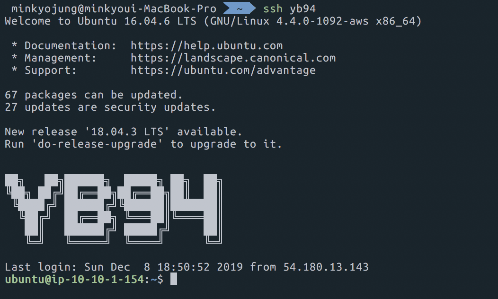

## ubuntu banner 추가

ubuntu server에 접속하였을 경우, 어떤 서버인지 보여주기 위해 banner를 이용한다.

### banner setting

배너는 /etc/motd 파일을 수정하면 첫 접속시 보여주게 된다.

Ascii 문자는 [http://patorjk.com/software/taag/#p=display&f=Graffiti&t=Type%20Something%20](http://patorjk.com/software/taag/#p=display&f=Graffiti&t=Type Something ) 에서 사용하며, font는 ANSI shadow를 이용한다.

### Banner 결과

